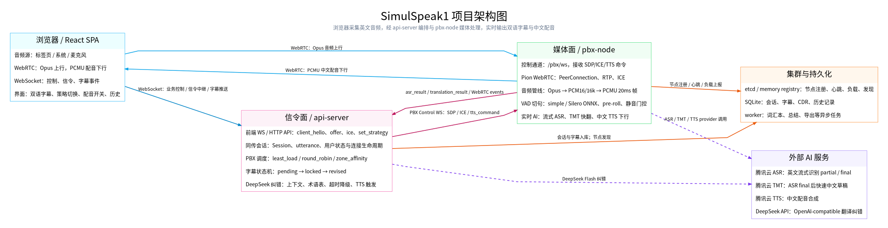
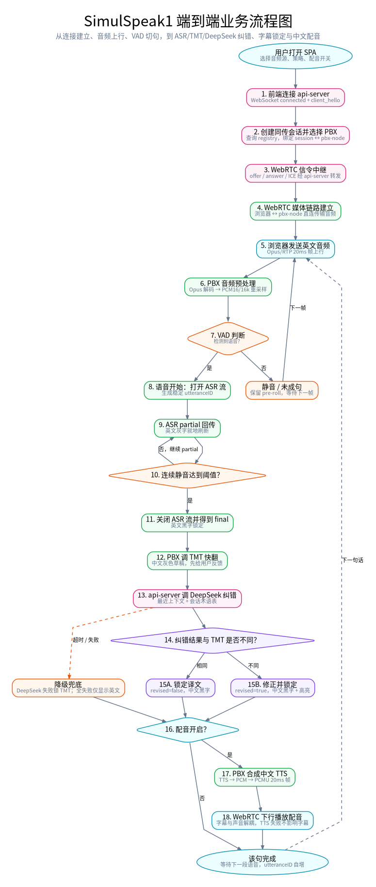
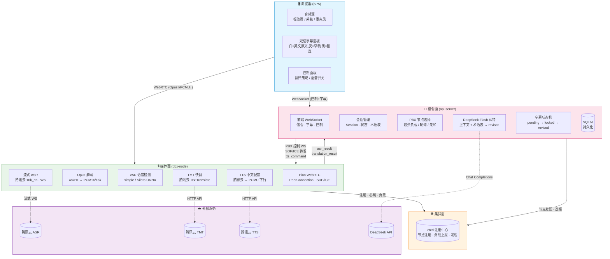
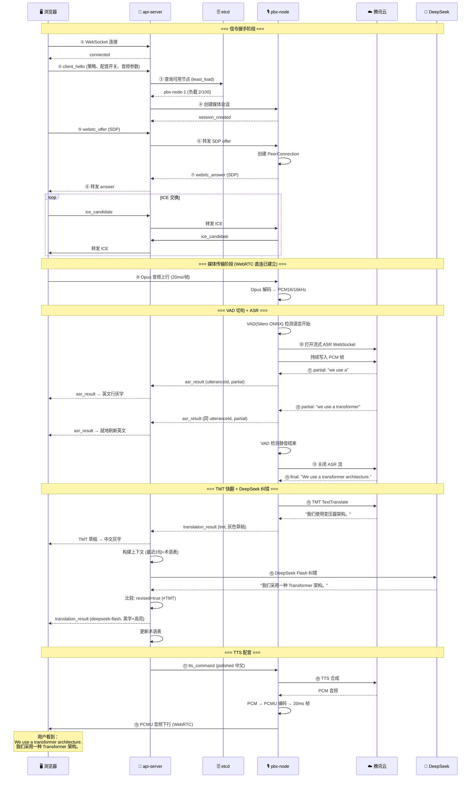
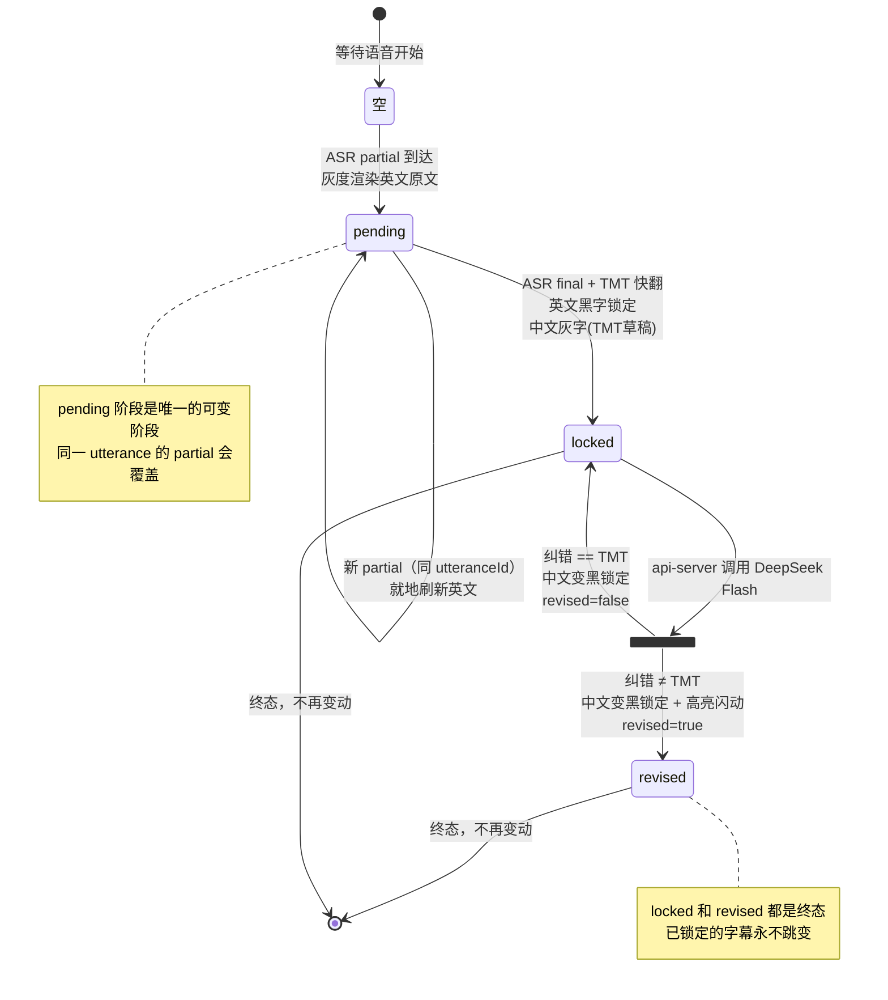
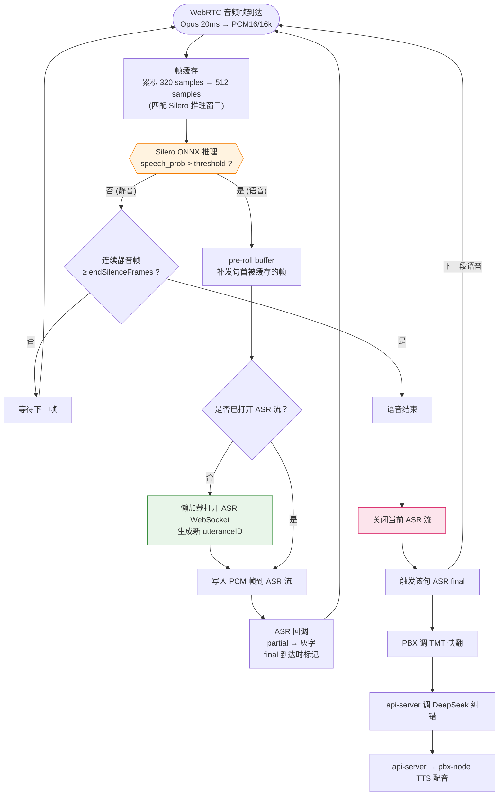
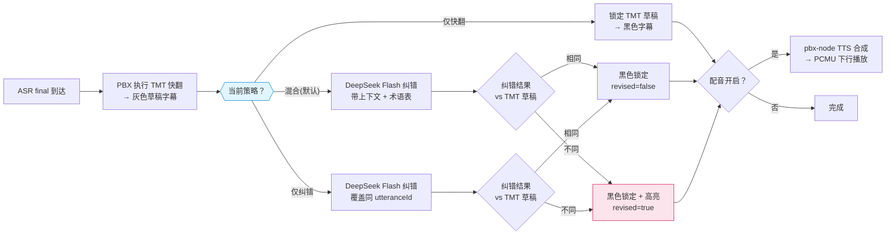
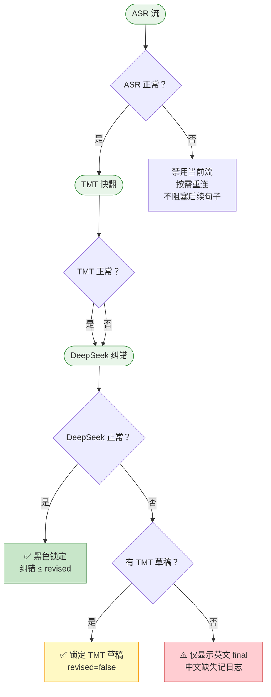
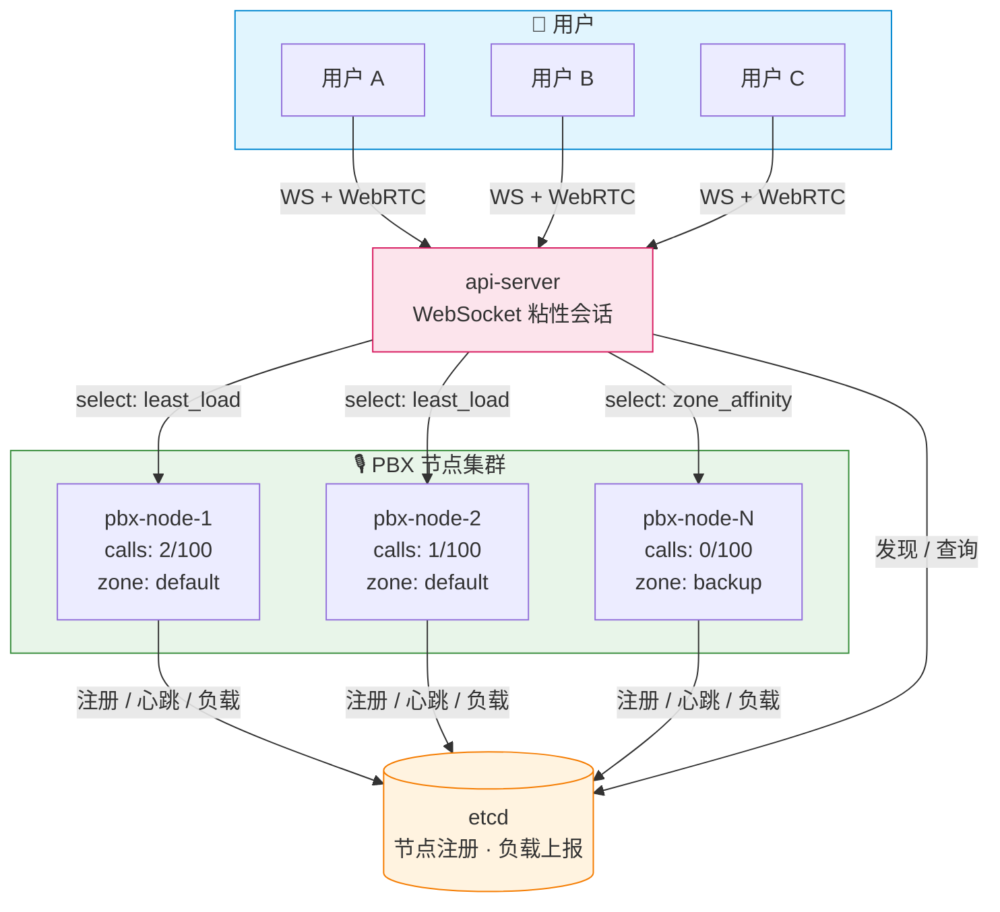

# SimulSpeak1 流程图

> 以下流程图使用 Mermaid 语法，GitHub / VS Code / 大部分 Markdown 渲染器均可直接展示。

## 已生成图片

| 图片 | SVG | PNG | 源文件 |
|------|-----|-----|--------|
| 项目架构图 | [architecture.svg](images/architecture.svg) | [architecture.png](images/architecture.png) | [architecture.dot](images/architecture.dot) |
| 端到端业务流程图 | [business-flow.svg](images/business-flow.svg) | [business-flow.png](images/business-flow.png) | [business-flow.dot](images/business-flow.dot) |

### 项目架构图

### 端到端业务流程图

---

## 1. 四层架构总览

---

## 2. 端到端数据流（时序图）

---

## 3. 字幕状态机（commit / revise）

---

## 4. VAD 切句 + ASR 流管理

---

## 5. 翻译策略决策流

---

## 6. 容错降级矩阵

---

## 7. 横向扩展拓扑

---

## 使用说明

这些图在以下环境中均可直接渲染：

- **GitHub / GitLab**：直接查看 Markdown 文件即可
- **VS Code**：安装 [Markdown Preview Mermaid Support](https://marketplace.visualstudio.com/items?itemName=bierner.markdown-mermaid) 插件
- **Typora / Obsidian**：内置支持
- **在线**：复制到 [Mermaid Live Editor](https://mermaid.live/) 查看和导出
